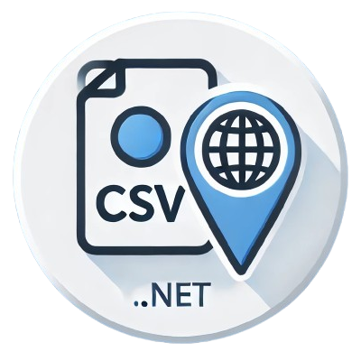

# DotLocz - .NET Localization Tool

**DotLocz** is a powerful .NET tool that transforms localization by converting `.loc.csv` files into **enum** and **RESX** files for multiple languages 🌐. Perfect for modular and large-scale projects, DotLocz can scan multiple projects at once, generating organized, project-specific resources. What used to be a manual, tedious process is now streamlined into an efficient workflow 🛠️.

## ✨ Features

- 📄 **CSV-Based Localization**: Simply define your localization content in `.loc.csv` files, and let DotLocz handle the rest.
- ⚙️ **Automatic Generation**: Produces both **RESX** files and **enums** to enable strong typing for localization keys.
- 🤖 **AI-Friendly**: The CSV format in DotLocz supports smooth autocompletion, making it easy to expand from English to other languages with confidence.
- 📂 **Multi-Project Support**: Efficiently scans and processes multiple .NET projects, creating a unique output directory with RESX and enum files for each project. Ideal for large solutions with numerous modules.
- 🚀 **Efficient Updates**: DotLocz only regenerates files when changes are detected, reducing build times and avoiding unnecessary overwrites.

## Installation

Install DotLocz globally using the .NET CLI:

```bash
dotnet tool install -g DotLocz
```

## Usage

Run the tool from the command line:

```bash
dot-locz [directory] [output-path]
```

- **`directory`**: The directory to scan for `.loc.csv` files. If omitted, the current directory is used.
- **`output-path`**: The folder where generated files will be saved. Defaults to a `Locz` subdirectory.

### Example

```bash
dot-locz /path/to/root-repo Locz
```

This command will:

- Scan the root directory for `.loc.csv` files across multiple projects.
- Generate a dedicated output folder within each project, containing its respective RESX and enum files.

## Example with Blazor WebAssembly

DotLocz includes a sample Blazor WebAssembly project (`DotLocz.Demo`) that showcases localization on default components like **Counter** and **Weather**. This is a quick way to see DotLocz in action and understand its output structure:

1. **Define Translations**: Create a `.loc.csv` file for each module or page, containing the keys and translations. **The name of the `.loc.csv` file determines the generated resource name**. For example, if the file is named `PagesResources.loc.csv`, DotLocz will generate:

   - An enum called `PagesResources`.
   - RESX files like `PagesResources.en-US.resx`, `PagesResources.fr-FR.resx`, etc.

   ```csv
   key,en-US,fr-FR,es-ES,ar-DZ,de-DE
   Home,Home,Accueil,Inicio,الصفحة الرئيسية,Startseite
   HelloWorld,Hello World!,Bonjour le monde!,¡Hola Mundo!,مرحبا بالعالم,Hallo Welt!
   WelcomeMessage,Welcome to your new app!,Bienvenue dans votre nouvelle application!,¡Bienvenido a tu nueva aplicación!,مرحبا بك في تطبيقك الجديد,Willkommen in Ihrer neuen App!
   Counter,Counter,Compteur,Contador,عداد,Zähler
   CurrentCount,Current count: {0},Compteur actuel: {0},Contador actual: {0},العدد الحالي: {0},Aktueller Stand: {0}
   ClickMe,Click me,Cliquez-moi,Haz clic en mí,انقر علي,Klick mich
   Weather,Weather,Météo,Tiempo,طقس,Wetter
   ```

2. **Register Localization**: In `Program.cs`, register the localization service and specify the resources path:

   ```csharp
   builder.Services.AddLocalization(options => options.ResourcesPath = "");
   ```

3. **Run DotLocz**: Execute DotLocz in the project directory to generate the RESX files and enums:

   ```bash
   dot-locz src/DotLocz.Demo Locz
   ```

   The tool will create a `Locz` folder near the `.csproj` file with:

   - **RESX files** for each language (e.g., `PagesResources.en-US.resx`).
   - **Enum for keys** named after the `.loc.csv` file (e.g., `PagesResources`).
   - **Helper Extension**: DotLocz adds an extension to make resource retrieval easier:

     ```csharp
     public static class LoczExtensions
     {
         public static string Get(this IStringLocalizer localizer, Enum key, params object[] args) =>
             localizer.Get(key.ToString(), args);

         public static string Get(this IStringLocalizer localizer, string key, params object[] args) =>
             localizer[key, args];
     }
     ```

4. **Use Resources in Components**: Access localized strings in your Blazor components with the generated `IStringLocalizer`. For example, in the **Counter** component:

   ```razor
   @page "/counter"
   @inject IStringLocalizer<PagesResources> Localizer

   <PageTitle>@Localizer.Get(PagesResources.Counter)</PageTitle>

   <h1>@Localizer.Get(PagesResources.Counter)</h1>

   <p role="status">@Localizer.Get(PagesResources.CurrentCount, currentCount)</p>

   <button class="btn btn-primary" @onclick="IncrementCount">@Localizer.Get(PagesResources.ClickMe)</button>
   ```

5. **Set Default Culture**: To see localization in action, set the default culture in `Program.cs` for demo purposes:

   ```csharp
   var language = "de-DE";
   CultureInfo.DefaultThreadCurrentCulture = new CultureInfo(language);
   CultureInfo.DefaultThreadCurrentUICulture = new CultureInfo(language);
   ```

You can experiment with different languages and see how DotLocz dynamically adapts the UI. This example demonstrates how easily DotLocz integrates into Blazor WebAssembly projects to provide multilingual support.

For a complete, interactive demo, visit the [DotLocz Demo Project](./src/DotLocz.Demo) on GitHub.

## Key Benefits in Large Projects

DotLocz is particularly beneficial in large, multi-project solutions. Having used DotLocz in a repository with over 50 .NET projects, here are some notable advantages:

- **AI-Friendly Autocompletion**: Autocomplete translations efficiently from English to other languages.
- **Organized Localization**: Separate `.loc.csv` files per module or page for clear structure and maintainability.
- **Faster Localization**: Skip manual RESX file handling and let DotLocz do the heavy lifting.
- **Multi-Project Scanning**: Easily manage localization for large solutions with numerous projects, each with its own output directory for RESX and enums.
- **Enjoyable Language Addition**: Adding languages is now an easy and enjoyable process, turning what used to be a tedious task into a manageable, even fun one!

## Contributing

Contributions and suggestions are highly appreciated. Please review our [Contributing Guidelines](CONTRIBUTING.md) for detailed information on how to participate.

## License

DotEventOutbox is open-sourced under the [MIT License](LICENSE.md).
